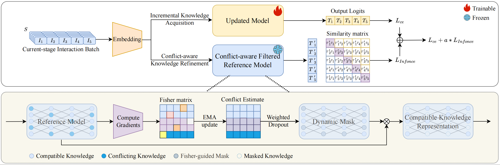

# SA-CAISR

Sequential recommendation (SR) aims to predict a user’s next action by learning from their his-
torical interaction sequences. In real-world applications, these models require periodic updates
to adapt to new interactions and evolving user preferences. While incremental learning methods
facilitate these updates, they face significant challenges. Replay-based approaches incur high
memory and computational costs, and regularization-based methods often struggle to discard
outdated or conflicting knowledge.



To overcome these challenges, we propose SA-CAISR, a Stage-Adaptive and Conflict-
Aware Incremental Sequential Recommendation framework. As a buffer-free framework, SA-
CAISR operates using only the old model and new data, directly addressing the high costs of
replay-based techniques. SA-CAISR introduces a novel Fisher-weighted knowledge-screening
mechanism that dynamically identifies outdated knowledge by estimating parameter-level con-
flicts between the old model and new data, allowing our approach to selectively remove obsolete
knowledge while preserving compatible historical patterns. This dynamic balance between
stability and adaptability allows our method to achieve a new state-of-the-art performance in
incremental SR. Experimental results on multiple datasets show that SA-CAISR outperforms
representative baselines while remarkably reducing memory usage by 97.6% and training
time by 63.9%. This efficiency allows real-world systems to rapidly update user profiles with
minimal computational overhead, ensuring more timely and accurate recommendations. Our
implementation can be found at: https://anonymous.4open.science/r/SA-CAISR-8C2F

## 🚀 Start

### 1. Env.
```bash
conda env create -f environment.yml
conda activate ENV_NAME
```
### 2. Data Preprocessing
```bash
python /data/preprocessing.py --dataset=DATASET_NAME
```
### 3. Pretrain
```bash
python baseline.py --dataset=DATASET_NAME --train_dir=YOUR_DIR
``` 
### 4. Incremental Fine-tune
```bash
python SA-CAISR.py --dataset=DATASET_NAME --train_dir=YOUR_DIR --state_dict_path=YOUR_PARAMETER_PATH
```